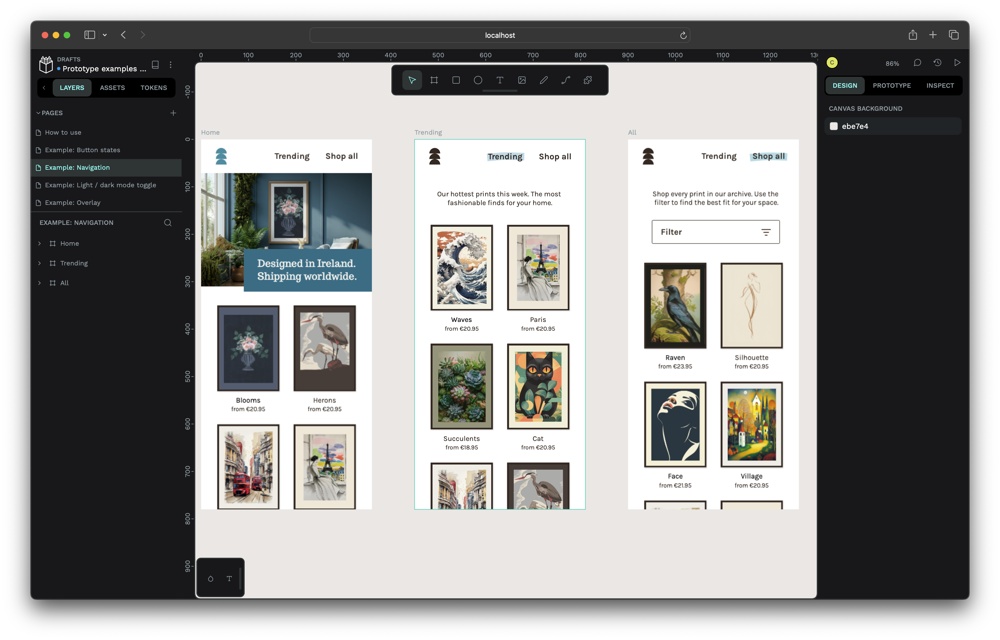

<div align="center">
    
</div>

# Penpot Docker

Run a local instance of [Penpot](https://penpot.app/) inside [Docker](https://www.docker.com/).


> ℹ️ **Requirements**
> 
> Make sure you have Docker installed and `docker compose` command is available on your system
>
> The scripts have been designed for macOS and should work on most Linux distros as well

## Installation


add `./bin` to your `Path` by adding this line inside `~/.zshrc` :

```shell
export PATH="<path-to...>/penpot-docker/bin:$PATH"
```

## Usage

The scripts should now be available in your terminal – just run them as needed
Penpot will run on http://localhost:9001

| command     | function                                                                                                               |
| ----------- | ---------------------------------------------------------------------------------------------------------------------- |
| penpot-up   | start up the penpot instance on `localhost:9001`.<br>You will have to create a user account when you first use the app |
| penpot-down | stops the instance. all projects and data will be persisted in Docker Volumes, so nothing gets lost                    |
